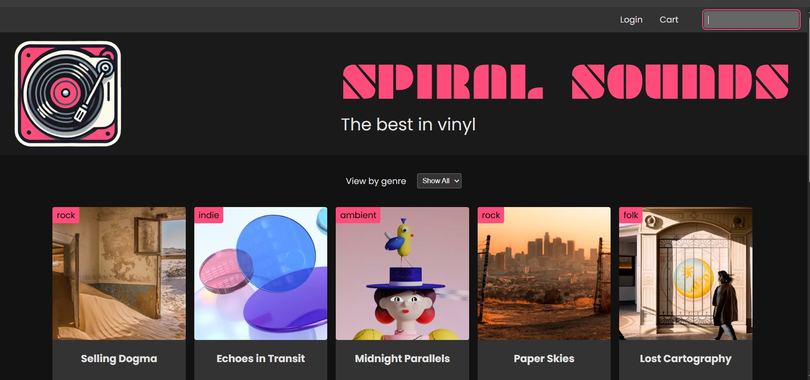
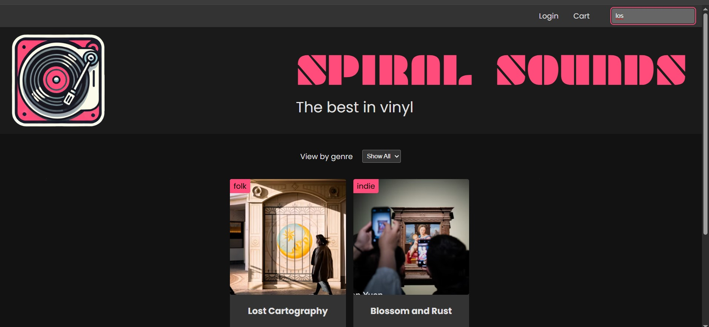
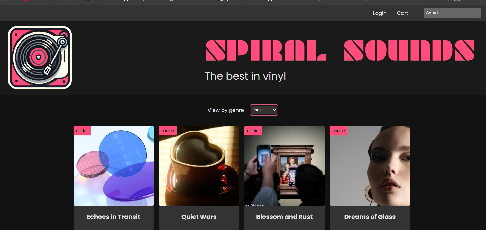
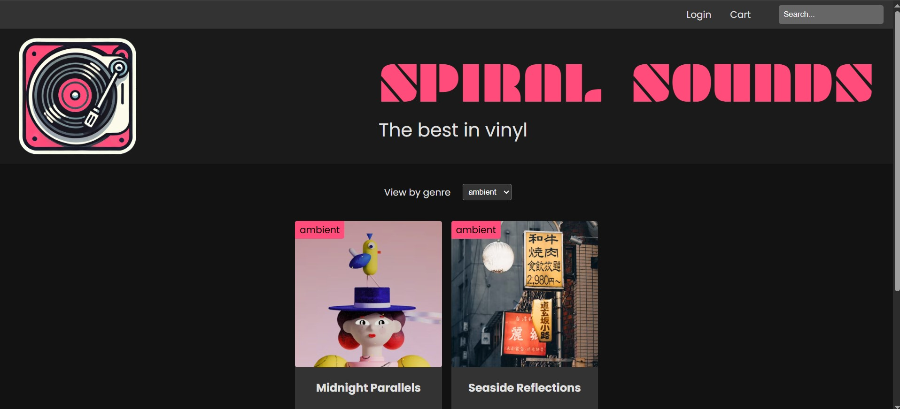

# Spiral Sounds – Simple Express Learning Project

This project is a beginner-friendly Express.js application that is a simple product listing site with search and filter functionality. It uses Express for the backend, SQLite for data storage, and vanilla JavaScript for the frontend.

## Features

- **Product listing**: Displays a list of vinyl records.
- **Search**: Instantly filter products by title, artist, or genre.
- **Dropdown filter**: Filter products by genre using a dropdown menu.
- **Static frontend**: Simple HTML/CSS/JS frontend served by Express.

## Getting Started

### Prerequisites

- [Node.js](https://nodejs.org/) (v18+ recommended)
- [npm](https://www.npmjs.com/)

### Installation

1. Clone or download this repository.
2. Install dependencies:
   ```bash
   npm install
   ```
3. Make sure you have a SQLite database file (`database.db`) in the root directory. (You can use the provided `CreateTable.js` to set up the database if needed.)

### Running the Project

Start the server with:

```bash
node server.js
```

The app will be available at [http://localhost:3000](http://localhost:3000).

## Project Structure

- `server.js` – Main Express server file
- `controller/ProductsController.js` – API logic for products and genres
- `route/products.js` – Express router for product endpoints
- `public/` – Static frontend files (HTML, CSS, JS, images)
- `db/db.js` – SQLite database connection

## API Endpoints

- `GET /api/products` – List all products (supports `search` and `genreFilter` query params)
- `GET /api/products/genres` – List all available genres

## Screenshots

### Home Page



### Search Feature



### Dropdown Filter (Example 1)



### Dropdown Filter (Example 2)



---

**Note:**  
This project is for learning and demonstration purposes. Feel free to explore and modify the code!
